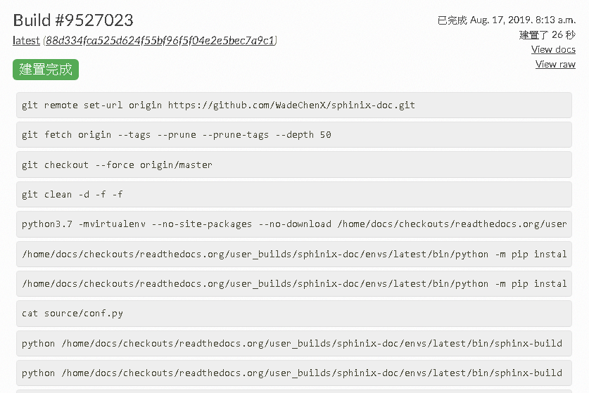
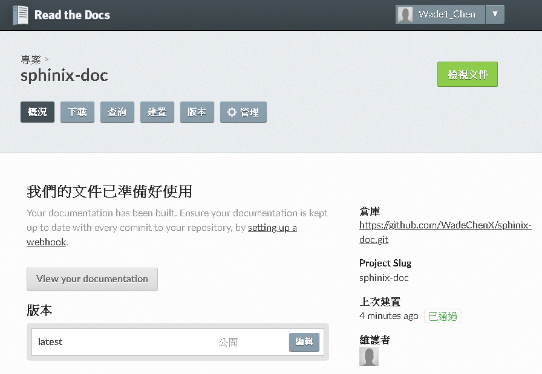
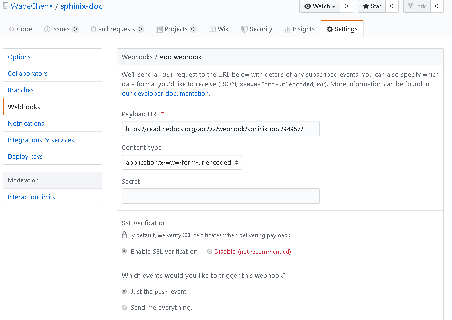

*****************************************
Connect & Deploy to ReadTheDoc websit
*****************************************

Export to ReadDoc website through GitHub
========================================

目錄下的檔案可以讓GitHub的方式來管理。並且將結果輸出至 `ReadTheDoc`_ 網站以便瀏覽。

.. _ReadTheDoc: https://readthedocs.org/

所以這裡便需要先準備：

* GitHub 帳號
* ReadTheDoc帳號
* 將最新的檔案提交到GitHub

接下來開始ReadTheDoc跟GitHub的連接。

.. image:: ./_static/readthedoc_01.png
    :alt: readthedoc_01
    :align: center

在 `ReadTheDoc`_ 的個人網站首頁可以將專案匯入。執行 **Import a Project** 。

.. image:: ./_static/readthedoc_02.png
    :alt: readthedoc_02
    :align: center

由於我們 **Sphinx說明文件** 是在GitHub 管理，故選擇連接GitHub。執行 **Connect to GitHub** 。

.. image:: ./_static/readthedoc_03.png
    :alt: readthedoc_03
    :align: center

接下來 `ReadTheDoc`_ 要求跟GitHub要求一些權限，這裡選擇開放權限。執行 **Authorize readthedocs** 。

.. image:: ./_static/readthedoc_04.png
    :alt: readthedoc_04
    :align: center

接下來選擇要匯入的專案。 **Sphinx說明文件** 位於 **WadeChenX/sphinx-doc** 。點選加號匯入。

.. image:: ./_static/readthedoc_05.png
    :alt: readthedoc_05
    :align: center

對比一下專案資料，選擇 **下一頁** 。

.. image:: ./_static/readthedoc_06.png
    :alt: readthedoc_06
    :align: center

這時環境已設定完成。可以開始建置工作了。版本預設是latest，若需要特別的版本號，可以自行編輯。執行 **Build version** 。

.. note::

    | 在匯入專案後，GitHub在Web Hook會增加一些規則，以方便文件更新時通知 `ReadTheDoc`_ 做建置工作。
    | 由於解說的關係，這邊會先刪除GitHub中關於Web Hook規則。

這時系統就會開始建置工作。如果有任何錯誤，可以看到編譯時的錯誤log，以方便修復。

如果編譯成功，可以回到 **概況** 頁，直接點選 **View your documentation** 來看到結果。

.. image:: ./_static/readthedoc_09.png
    :alt: readthedoc_09
    :align: center

接下來開始連接GitHub。為了讓GitHub在專案內容更新通知 `ReadTheDoc`_ 做建置工作，必須做些設定。

選擇 **管理** 頁，並在左欄選擇 **Integration** ，再右邊執行 **Add integration** 。

.. image:: ./_static/readthedoc_10.png
    :alt: readthedoc_10
    :align: center

這時你能看到一條URL，如此種格式： *https://readthedocs.org/api/v2/webhook/<project-name>/<id>/* 

在這個例子是 *https://readthedocs.org/api/v2/webhook/sphinix-doc/94957/* 

把它複製一下。

到GitHub的 **Sphinx說明文件** 這個專案下。選擇 **Settings** 頁，再選擇 **Webhooks** ，再將複製好的URL貼到 **Payload URL** ，底下選擇好它的通知事件。此例是 *push* 事件。

設定好後，接下來每次專案更新後，都會觸發 `ReadTheDoc`_ 做建置工作。

