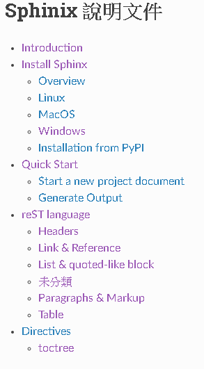
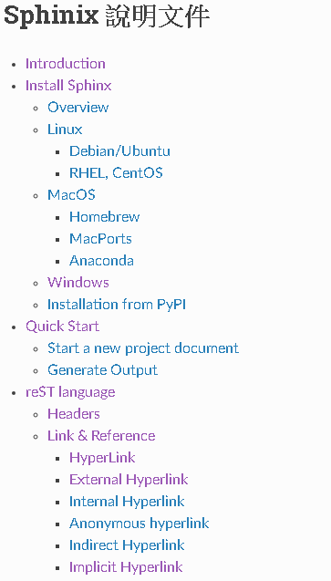
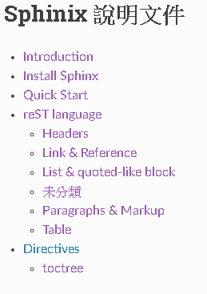

******************
toctree
******************

| 原本的reST檔案，本身無法連結到其它檔案。故Sphinx提供此種方法，來互相連結檔案。
| 使用toctree，可以連結其它reST檔案，並形成連結清單。

基本語法：

.. code-block:: reST

    .. toctree::
        :<property setting>:
        
        <reST file>
        .....

Property setting
==================
        
maxdepth
    設定toctree能夠顯示的最大層數。
    
titlesonly
    只有顯現出每層的標題
    
hidden
    隱藏所有連結。
    
numbered
    會幫你把所有toctree的標題前都加上編號，必須把doctree內的資料都砍掉才能復原。
    
glob
    在make時，toctree只會在此檔案所在的目錄去掃描對映的檔案。使用glob關鍵字，可以掃描指定資料夾內的rst案，並使用萬用字元。
    
    
Example
===========

我們由此文件的總目錄來當範例：

.. code-block:: reST

    .. toctree::
        :maxdepth: 2     
   
        introduction
        installation
        quick-start
        reST/index
        directive/index    

    
demo:

maxdepth = 3

.. code-block:: reST

    .. toctree::
        :maxdepth: 3
   
        introduction
        installation
        quick-start
        reST/index
        directive/index    

demo:

可以看到當maxdepth = 3時，清單連結會根據rst檔案內的章節、標題、子標題…等來建立連結清單。

maxdepth = 3, titlesonly

.. code-block:: reST

    .. toctree::
        :maxdepth: 3
        :titlesonly:
   
        introduction
        installation
        quick-start
        reST/index
        directive/index    

demo:

可以看到設定了titlesonly後，清單連結只會使用rst檔案的最上面的標題。

本身的說明文件reST/index.rst使用了 **glob** 關鍵字：

.. code-block:: reST

    .. toctree::
        :maxdepth: 1     
        :glob:
   
        *

此關鍵字會直接納入reST目錄底下的檔案(所有都是*.rst)。

