************
Quick Start
************

Start a new project document
============================

可以使用以下指令開新專案(假設已在專案目錄)：

.. code-block:: bat

    sphinx-quickstart
    
開新的專案過程中，會詢問一些問題。在本文件中，例子如下：

::

    (1) Separate source and build directories (y/n) [n] : y
    (2) Project name: test_prj
    (3) Author name(s): test_author
    (4) Project release []: beta-0.1
    (5) Project language [en]: en
    
關於第1個問題，區不區分source和build目錄，目錄結構如下：

+------------------------+-----------------------+
| Non Seperate           | Seperate              |
+========================+=======================+
| $ tree                                         |
+------------------------+-----------------------+
| | .                    | | .                   |
| | \|-- Makefile        | | \|-- Makefile       |
| | \|-- **_build**      | | \|-- **build**      |
| | \|-- _static         | | \|-- make.bat       |
| | \|-- _templates      | | \`-- source         |
| | \|-- conf.py         | |     \|-- _static    |
| | \|-- index.rst       | |     \|-- templates  |
| | \`-- make.bat        | |     \|-- conf.py    |
| |                      | |     \`-- index.rst  |
+------------------------+-----------------------+

這部份就看個人喜好。產生最後結果的目錄，左欄是 **_build** ，右欄是 **build** 。

關於第4個問題，釋出的版本原則上是一字串，可以是 **apha** 、 **beta** 、 **v0.1** .... 等。格式不限制。

關於第5個問題，語言的支援可以看 `language support`_ 。

.. _language support: https://www.sphinx-doc.org/en/master/usage/configuration.html#confval-language

Generate Output
==================

在基本設置結束後，相關的設定都會在 **conf.py** 這個檔案，之後可以再做修改。

而現在可以打指令來產生結果了。指令如下：

.. code-block:: bat

    make html

或是

.. code-block:: bat

    make latexpdf

來產生網頁包或是pdf文件。

.. note::

    產生pdf文件還需要安裝一些程式套件，這部份要看用哪個作業系統。請參閱相關章節。

Export to ReadDoc website through GitHub
==========================================

目錄下的檔案可以讓GitHub的方式來管理。並且將結果輸出至 `ReadTheDoc`_ 網站以便瀏覽。

.. _ReadTheDoc: https://readthedocs.org/

所以這裡便需要先準備：

* GitHub 帳號
* ReadTheDoc帳號
* 將最新的檔案提交到GitHub

接下來開始ReadTheDoc跟GitHub的連接。

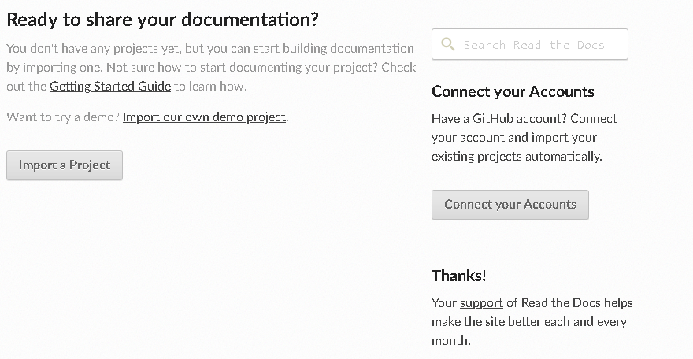

在 `ReadTheDoc`_ 的個人網站首頁可以將專案匯入。執行 **Import a Project** 。

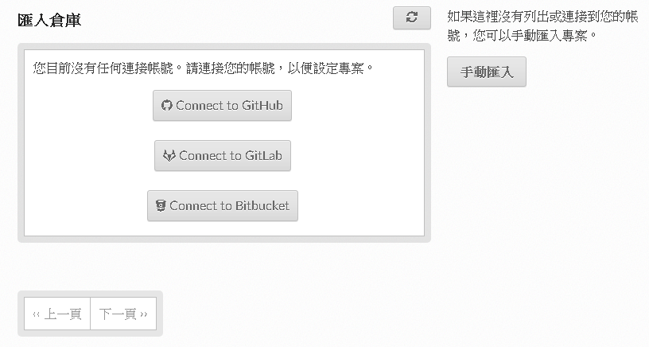

由於我們 **Sphinx說明文件** 是在GitHub 管理，故選擇連接GitHub。執行 **Connect to GitHub** 。

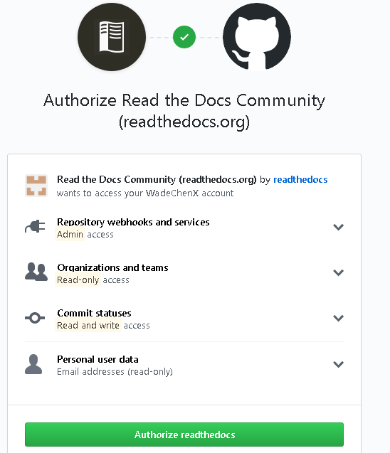

接下來 `ReadTheDoc`_ 要求跟GitHub要求一些權限，這裡選擇開放權限。執行 **Authorize readthedocs** 。

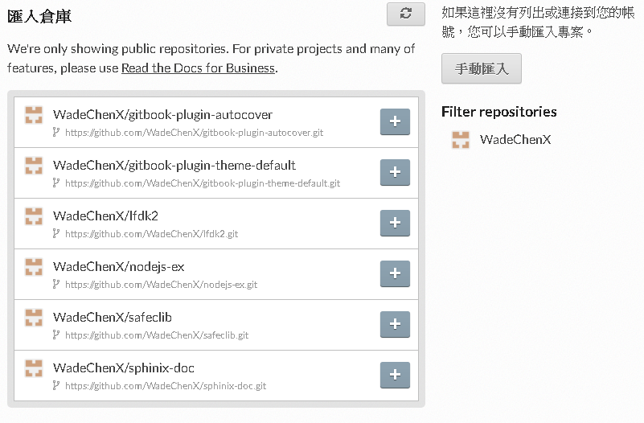

接下來選擇要匯入的專案。 **Sphinx說明文件** 位於 **WadeChenX/sphinx-doc** 。點選加號匯入。

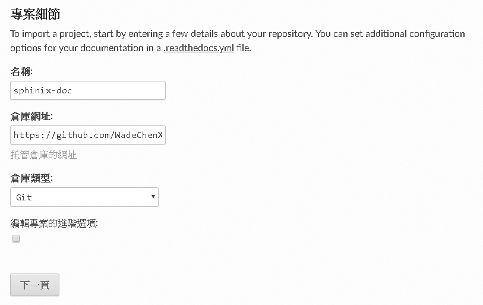

對比一下專案資料，選擇 **下一頁** 。

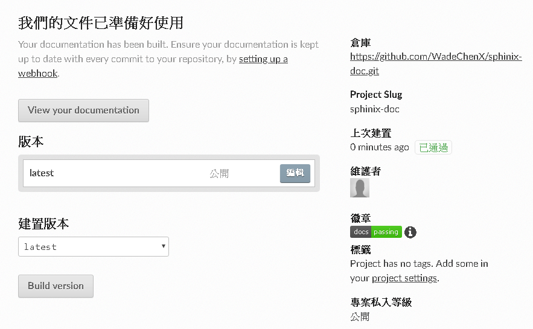

這時環境已設定完成。可以開始建置工作了。版本預設是latest，若需要特別的版本號，可以自行編輯。執行 **Build version** 。

.. note::

    | 在匯入專案後，GitHub在Web Hook會增加一些規則，以方便文件更新時通知 `ReadTheDoc`_ 做建置工作。
    | 由於解說的關係，這邊會先刪除GitHub中關於Web Hook規則。

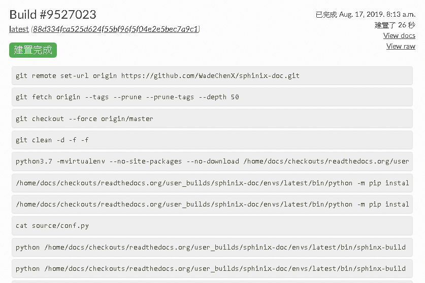

這時系統就會開始建置工作。如果有任何錯誤，可以看到編譯時的錯誤log，以方便修復。

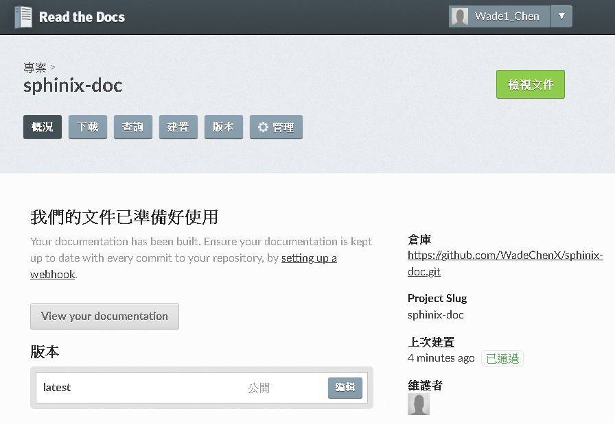

如果編譯成功，可以回到 **概況** 頁，直接點選 **View your documentation** 來看到結果。

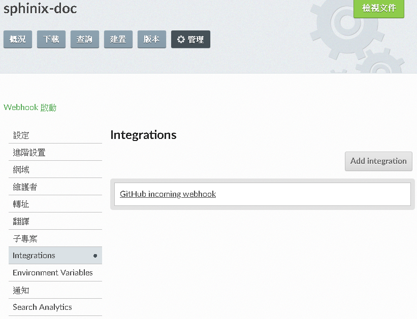

接下來開始連接GitHub。為了讓GitHub在專案內容更新通知 `ReadTheDoc`_ 做建置工作，必須做些設定。

選擇 **管理** 頁，並在左欄選擇 **Integration** ，再右邊執行 **Add integration** 。

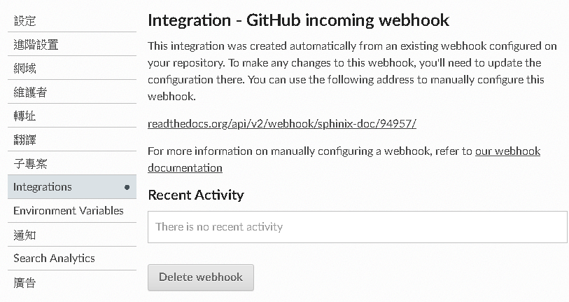

這時你能看到一條URL，如此種格式： *https://readthedocs.org/api/v2/webhook/<project-name>/<id>/* 

在這個例子是 *https://readthedocs.org/api/v2/webhook/sphinix-doc/94957/* 

把它複製一下。

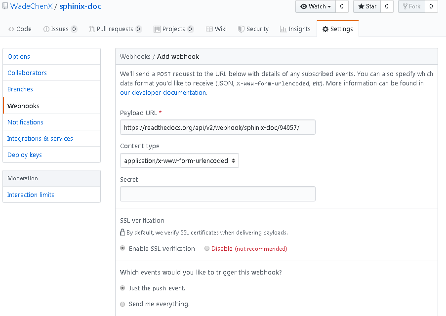

到GitHub的 **Sphinx說明文件** 這個專案下。選擇 **Settings** 頁，再選擇 **Webhooks** ，再將複製好的URL貼到 **Payload URL** ，底下選擇好它的通知事件。此例是 *push* 事件。

設定好後，接下來每次專案更新後，都會觸發 `ReadTheDoc`_ 做建置工作。

